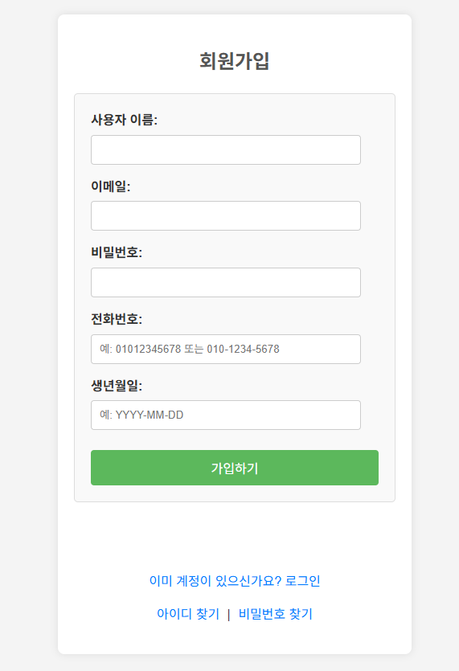
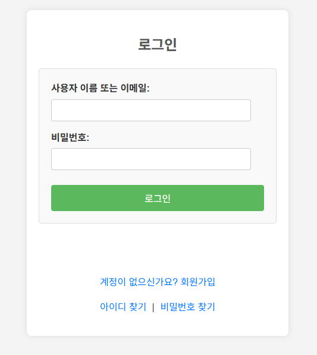
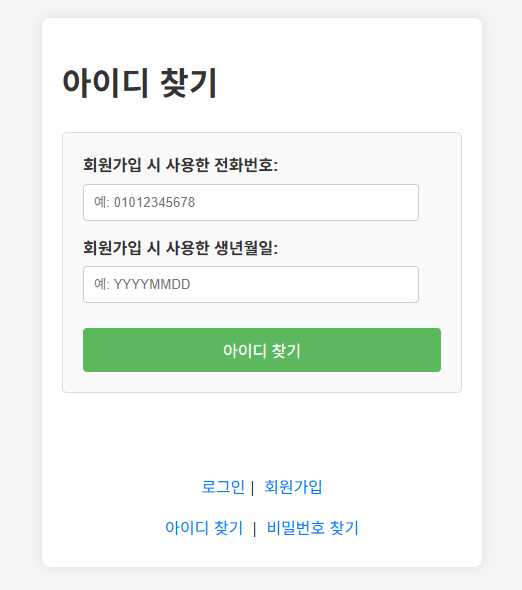
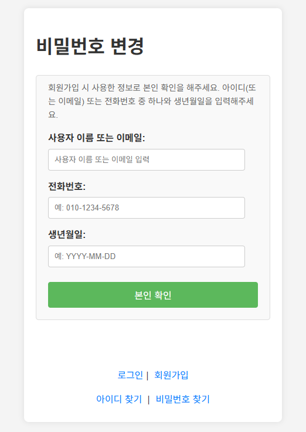
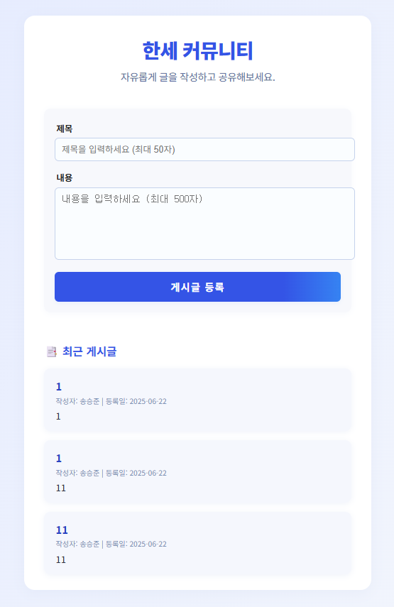

# 한세 커뮤니티 게시판

한세대학교 학생/구성원을 위한 커뮤니티 게시판 서비스입니다.  
누구나 회원가입 후 자유롭게 글을 작성하고, 전체 글 목록을 확인할 수 있습니다.

## 주요 기능

- **회원가입/로그인**:  
  사용자 정보를 입력하여 회원가입, 로그인 가능  
  (비밀번호 암호화, 휴대폰/생년월일 기반 아이디 찾기 및 비밀번호 재설정 포함)
- **게시글 작성/목록**:  
  로그인 시 게시글 작성 가능  
  작성자(닉네임), 등록일, 내용 등이 리스트에 표시
- **비로그인 상태**:  
  글쓰기 폼 숨김, 게시글 목록만 확인 가능
- **작성자명(닉네임) 연동**:  
  게시글마다 실제 사용자 닉네임(아이디) 출력

## 기술 스택

- **Backend**:  
  FastAPI, SQLAlchemy, MySQL, Pydantic, bcrypt
- **Frontend**:  
  HTML, CSS, JavaScript (Vanilla JS)
- **기타**:  
  CORS 설정, 환경변수 관리(.env)

## 폴더 구조

project-root/
<br>
├── backend/
<br>
│ ├── main.py # FastAPI 진입점 (회원, 게시글, 인증 전체 처리)
<br>
│ ├── routers/
<br>
│ │ └── post_router.py # 게시글 CRUD 라우터
<br>
│ └── ... # 설정, DB, 기타 모듈
<br>
├── frontend/
<br>
│ ├── post.html # 게시판 페이지 (JS 연동)
<br>
│ ├── script.js # 프론트엔드 로직 (회원, 글, 인증 등)
<br>
│ └── ... # 추가 HTML (로그인, 회원가입 등)
<br>
└── README.md # 프로젝트 소개 파일 (이 문서)
<br>


## 환경 변수(.env) 예시

`.env` 파일을 `backend/` 폴더에 위치시키고 실제 항목을 입력하세요.

DB_USER=
DB_PASSWORD=
DB_HOST=
DB_NAME=


## 설치 및 실행 방법

**MySQL 데이터베이스 및 테이블 준비**  
   (스키마/테이블 자동 생성은 main.py에서 처리, 직접 생성 시 DDL 참고)

<br>

**서버 실행**
    ```bash
    uvicorn backend.main:app --reload
    ```

<br>

**브라우저 접속**  
   [http://127.0.0.1:8000/frontend/post.html](http://127.0.0.1:8000/frontend/post.html)

## 커밋 가이드

- 기능별, 페이지별로 커밋 메시지 작성
- git add/commit 명령 참고 (README 아래쪽 예시 참조)

## 화면별 소개

### 회원가입
사용자는 이름, 이메일, 비밀번호, 전화번호, 생년월일을 입력하여 회원가입할 수 있습니다.  
전화번호와 생년월일 입력 형식에 대한 예시도 placeholder로 안내됩니다.



---

### 로그인
회원가입 시 등록한 사용자 이름 또는 이메일, 비밀번호를 입력해 로그인할 수 있습니다.



---

### 아이디 찾기
가입 시 사용한 전화번호와 생년월일을 입력하면, 해당 정보로 가입한 계정의 아이디(또는 이메일)를 찾을 수 있습니다.



---

### 비밀번호 변경
아이디(이메일/사용자이름), 전화번호, 생년월일 정보를 입력해 본인임을 인증한 후 비밀번호를 변경할 수 있습니다.



---

### 커뮤니티
자유롭게 게시글을 작성하고 최근 게시글 목록을 확인할 수 있는 커뮤니티 화면입니다.

